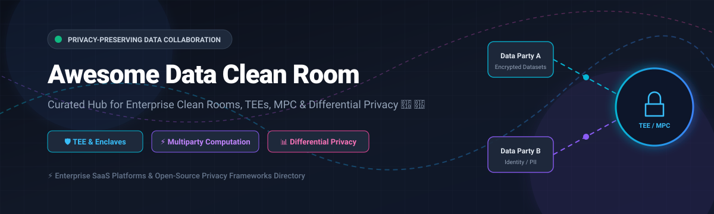

# Awesome Data Clean Room 🔐 🤝 🛡️

  

  
  
  
  
  
  

---

## 🌟 Top Data Clean Room Ecosystem & Privacy-Preserving Analytics Directory 🚀

**The Ultimate Curated List of Commercial Data Clean Room (DCR) Platforms, Open-Source Privacy-Preserving Analytics Tools, Secure Multiparty Computation (MPC) Frameworks, and Trusted Execution Environment (TEE) Solutions.** 🔒⚡

*Key focus areas: Multiparty Computation (MPC), Trusted Execution Environments (TEE), Differential Privacy (DP), Private Set Intersection (PSI), Zero-Knowledge Proofs (ZKP), and Self-Hosted Data Clean Rooms.*

**Last updated: October 2026** 📅

---

### 📌 Overview & SEO Summary 🔍

Welcome to the comprehensive, SEO-optimized reference directory for **Data Clean Rooms (DCRs)**, **Privacy-Enhancing Technologies (PETs)**, and **Confidential Computing Infrastructure**. Data clean rooms enable multiple organizations to combine, analyze, and query sensitive first-party datasets securely without exposing raw personal data (PII) or proprietary business metrics to external collaborators or platform operators.

Whether you are evaluating enterprise-grade commercial platforms (*Microsoft Azure*, *Amazon AWS Clean Rooms*, *Google Cloud*, *Snowflake*, *Databricks*), identity-resolution clean rooms (*LiveRamp*, *InfoSum*, *Habu*), or self-hostable open-source frameworks (*OpenMined PySyft*, *TikTok PrivacyGo*, *Linux Foundation Manatee*, *SecretFlow*, *Google Open Differential Privacy*), this guide provides clear comparisons across pricing, enterprise scale, evaluation limits, and security architecture.

#### 💡 Key Market Drivers & Architecture Context:
- **Cookie Deprecation & Regulatory Compliance**: Rapid transition to zero-party and first-party data collaboration driven by global privacy regulations (GDPR, CCPA, CPRA, HIPAA) and third-party tracking restrictions.
- **Trusted Execution Environments (TEEs)**: Hardware-enforced isolation (Intel SGX, AMD SEV, AWS Nitro Enclaves) guarantees data remains encrypted in memory during active query execution.
- **Two-Stage Execution Model**: Modern clean rooms isolate the **Interactive Programming Stage** (exploring synthetic data or DP-noise protected schema) from the **Attested Execution Stage** (executing cryptographic code on live datasets within verified TEE containers).

---

## 📑 Table of Contents 📖

- [🏢 Enterprise SaaS & Commercial Clean Room Platforms](#-enterprise-saas--commercial-clean-room-platforms)
- [🔓 Open-Source GitHub Clean Room & PET Projects](#-open-source-github-clean-room--pet-projects)
- [🛠️ How to Contribute](#%EF%B8%8F-how-to-contribute)
- [📊 Star History](#-star-history)
- [🤝 Support & Sponsorship](#-support--sponsorship)
- [⚠️ Disclaimer](#%EF%B8%8F-disclaimer)

---

## 🏢 Enterprise SaaS & Commercial Clean Room Platforms 💰

📈 **Market Size & Structure:**  
The global Data Clean Room market is estimated at **$4.8 Billion (2026)** and projected to reach **$12.5 Billion by 2030** (CAGR ~27%). The market is **moderately fragmented**: dominated at the infrastructure tier by hyperscalers (Microsoft, Alphabet/Google, Amazon) and cloud data platforms (Snowflake, Databricks), while specialized identity resolution and multi-party ad-tech platforms (LiveRamp, InfoSum, Decentriq) serve specialized vertical niches.

*Sorted by Valuation / Market Cap / Enterprise Revenue (Descending)* 📊

| SaaS / Commercial Platform | Company / Owner | Market Scale (Valuation / Market Cap) 📈 | Standard Edition Starting Price 💵 | Free Tier / Free Trial Limits 🎁 | Description & Core Architecture 🛡️ |
| :--- | :--- | :--- | :--- | :--- | :--- |
| **[Azure Confidential Clean Rooms](https://azure.microsoft.com/en-us/products/confidential-clean-rooms/)** 🔷 | Microsoft | ~$3.90 Trillion (Market Cap) | **$0.0031 / vCPU-hour** (Confidential VM base rate) | **$200 free credit** (30-day Azure trial) | **Confidential computing clean room** — Apache Spark SQL in TEE protects data from collaborators and Azure operators. Confidential Consortium Framework (CCF) for governance and verifiable audit logs. 🔒 |
| **[AWS Clean Rooms](https://aws.amazon.com/clean-rooms/)** ☁️ | Amazon | ~$2.00 Trillion (Market Cap) | **$0.80 / CRPU-hour** (Clean Rooms Processing Unit) | **AWS Free Tier**: 12 months free / $300 credits | **AWS-native clean room** — Collaborate on combined datasets without sharing raw data. Built-in differential privacy for aggregate queries and automated analysis rules. Integrates natively with S3, Athena, and Glue. ⚡ |
| **[Google Ads Data Hub](https://adsdatahub.google.com/)** 🌐 | Google (Alphabet) | ~$2.00 Trillion (Market Cap) | **$0.035 / MB processed** (BigQuery query rate) | **$300 free trial credits** (Google Cloud 90-day trial) | **Google Ads clean room** — Privacy-safe measurement, audience building, and attribution for advertising campaigns. Aggregation thresholds prevent user-level identification. Integrates with BigQuery Data Clean Rooms. 🎯 |
| **[Snowflake Data Clean Rooms](https://www.snowflake.com/)** ❄️ | Snowflake | ~$50.00 Billion (Market Cap) | **$2.00 / Snowflake Credit** (Standard Edition) | **$400 free trial credits** (30-day Snowflake trial) | **Data cloud clean room** — Data stays in each party's Snowflake account (no data movement). Analysis rules define allowed queries with native App framework integration (includes Samooha tech). ❄️ |
| **[Azure Databricks Clean Rooms](https://databricks.com/)** 🧱 | Databricks | ~$43.00 Billion (Valuation) | **$0.15 / DBU** (Databricks Unit serverless rate) | **14-day free trial** (Full platform access) | **Lakehouse clean room** — OpenSharing for secure data exchange without copying. No-trust model where all collaborators approve notebooks before serverless TEE execution. 🌟 |
| **[LiveRamp Safe Haven](https://liveramp.com/)** 🟢 | LiveRamp (incl. Habu) | ~$3.00 Billion (Market Cap) | **$25,000 / year** (Starting enterprise plan) | **14-day interactive sandbox trial** | **Data collaboration platform** — Secure data clean room with RampID identity resolution. Unified measurement, cross-media activation, and analytics (incorporates Habu orchestration). 🤝 |
| **[InfoSum](https://www.infosum.com/)** 🔵 | InfoSum | ~$500 Million (Private Valuation) | **$15,000 / year** (Base subscription tier) | **14-day custom POC demo access** | **Identity-based clean room** — Non-relational federated identity infrastructure. Zero data movement — datasets remain strictly inside each client's boundary without PII exchange. 🛡️ |
| **[Decentriq](https://www.decentriq.com/)** 🔒 | Decentriq | ~$100 Million (Private Valuation) | **$1,200 / month** (Starting SaaS subscription) | **30-day trial environment** | **Confidential computing clean room** — TEE-based secure analytics (Intel SGX / Confidential VMs). Swiss-hosted compliance for GDPR & HIPAA strict privacy benchmarks. 🇨🇭 |

---

## 🔓 Open-Source GitHub Clean Room & PET Projects 🌐

*Sorted by GitHub Star Count (Descending)* 🌟

- **[Cleanlab](https://github.com/cleanlab/cleanlab)**  🧪  
  **Standard data-centric AI package for data quality, automated curation, and machine learning with messy real-world data and labels**, AGPL-3.0 licensed. Ensures high clean room input data integrity through machine learning error detection and automated dataset scrubbing.

- **[PySyft (OpenMined)](https://github.com/OpenMined/PySyft)**  🔒  
  **Library for privacy-preserving data science, federated learning, and confidential data collaboration**, Apache-2.0 licensed. Performs secure remote execution, differential privacy governance, and multiparty computation across distributed data nodes.

- **[Differential Privacy (Google)](https://github.com/google/differential-privacy)**  📊  
  **Google's open-source differential privacy libraries in C++, Java, and Go**, Apache-2.0 licensed. Contains mathematical building blocks for differential privacy aggregation, Laplace/Gaussian noise mechanisms, and private SQL query engine tools.

- **[SecretFlow](https://github.com/secretflow/secretflow)**  ⚡  
  **Unified framework for privacy-preserving data intelligence and federated learning**, Apache-2.0 licensed. Supports multi-party computation (MPC), Private Set Intersection (PSI), Homomorphic Encryption (HE), and TEE hardware orchestration.

- **[aws-sdk-pandas](https://github.com/aws/aws-sdk-pandas)**  ☁️  
  **Pandas on AWS — unified SDK for cloud data integration**, Apache-2.0 licensed. Executes privacy-protected SQL queries inside AWS Clean Rooms, returning result sets directly as pandas DataFrames across EMR and Ray clusters.

- **[aws-data-wrangler](https://github.com/awslabs/aws-data-wrangler)**  🐼  
  **AWS pandas integration library & data pipeline utility**, Apache-2.0 licensed. Facilitates clean room query execution, data transformation, and privacy-preserving data lake interaction across S3, Glue, and Athena.

- **[PrivacyGo Data Clean Room (PGDCR)](https://github.com/tiktok-privacy-innovation/PrivacyGo-DataCleanRoom)**  🏛️  
  **Open-source TEE-based data clean room for secure research & AI collaboration**, Apache-2.0 licensed. Developed by TikTok and contributed to the Confidential Computing Consortium (CCC) under the Linux Foundation. Uses a two-stage Jupyter Notebook & CVM execution pipeline.

- **[Manatee (Linux Foundation / CCC)](https://github.com/manatee-project/manatee)**  🌊  
  **Multi-party data collaboration platform**, Apache-2.0 licensed. The official Linux Foundation Confidential Computing Consortium successor to PrivacyGo, enabling interactive exploration of synthetic/DP data and attested TEE code verification.

- **[OpenEnv Data Cleanser](https://huggingface.co/spaces/sairaj2/DataCleanser)**  🧼  
  **Dockerized FastAPI data cleaning environment**, MIT licensed. Simulates real-world data preparation, deduplication, missing value imputation, and formatting required prior to uploading datasets into secure clean rooms.

---

## 🛠️ How to Contribute 🤝

Contributions are actively welcomed! To submit new data clean room platforms or open-source privacy-enhancing tools:

1. 🍴 **Fork** this repository.
2. 📝 **Add/Edit** entries in `README.md` following the precise table and bullet list structure.
3. 🔗 Ensure all links, stargazers badges, pricing data, free trial limits, and valuation metrics are verified.
4. 🚀 Submit a **Pull Request** with a descriptive title detailing your additions.

---

## 📊 Star History 📈

---

## 🤝 Support & Sponsorship 💖

If this Data Clean Room resource helps your privacy engineering team or business research:

- ⭐ **Star** this repository to help others discover it!
- 🔀 **Fork** and share with data collaboration teams, privacy engineers, and open-source researchers.
- ☕ **Sponsor**: Support open-source curation via the [GitHub Sponsor Dashboard](https://github.com/sponsors/ishandutta2007).

---

## ⚠️ Disclaimer ℹ️

- This directory is **community-curated** for educational and architectural evaluation purposes.
- **Azure Confidential Clean Rooms** preview release is intended for testing and evaluation; do not process unverified compliance data in preview instances.
- **PrivacyGo / Manatee** framework implementations require hardware TEE support (Intel SGX, AMD SEV) and attestation verification setups prior to production deployment.

---

  <b>Made with ❤️ for privacy engineers, data collaboration teams, and confidential computing advocates.</b>

